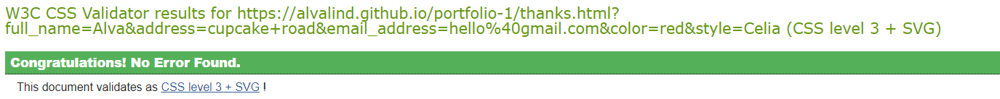

# C-LABEL 

The C-LABEL website is your one-stop destination for all things related to C-Label bags. 
Discover more about the brand, including what sets their bags apart, and explore the diverse range of products on offer. The website is made to help C-label customers to engage with the brand and place their order for their own customized C-label bag!

With our user-friendly form, you can easily design your own bag and receive a personalized price quote. 
Plus, don't forget to sign up for the newsletter to stay in the loop about new bag releases and sales.

Whether you're a fashion enthusiast or simply curious about C-Label, the website caters to anyone with a love for stylish bags and quality craftsmanship.

You can find C-labels website [HERE](https://alvalind.github.io/c-label/)


## User Stories 

### First Time Visitor Goals 

  * Understanding the Main Purpose
  As a first-time visitor, I want to easily grasp the main purpose of the site so I can learn more about the organization and what it offers.

  * Navigating the Website
  As a first-time visitor, I expect to find it easy to navigate through the website, allowing me to locate the content I'm interested in without any hassle.

  * Viewing Real-World Proof
  As a first-time visitor, I anticipate the inclusion of images showcasing C-LABEL bags, providing me with tangible real-world proof of the products in action and helping me visualize their quality and appeal.


### Returning Visitor Goals 

  * Enhanced User Experience
  As a returning customer, I expect the website to provide me with an enhanced user experience, ensuring smooth navigation, intuitive interface elements, and easy access to the information I need, making my browsing experience seamless and enjoyable.

  * Responsive Design and Accessibility
  As a returning customer, it's important to me that the website is responsive and accessible across different devices and screen sizes. Whether I'm browsing on my desktop, tablet, or smartphone, I expect the website to adapt smoothly, allowing me to engage with it effortlessly from anywhere.

  * Consistent Branding and Visual Identity
  As a returning customer, I look for consistency in branding and visual identity throughout the website. Seeing familiar design elements, colour palette and branding reassures me, strengthening my trust and connection with the brand.


## Features
### 1. Navigation
  * Featured at the top of the page, the navigation shows the brand name in the top left corner and links to the home page
  * The other navigation links are placed to the right: Home, Order Now and About Us. These links to other sites of the website. 
  * The navigation is clear about the companys name and where to click to find more info.
  * The Nav is toggled on smaller screens to make it easier to navigate the page 
  
  
  

### 2. Header
  * Displays the company's logo for brand recognition.

  

### 3. Information
  * Details about the bag manufacturing process, yarn used, and available styles displayed for transparency and authenticity.
  
  

### 4. Buttons
  * Multiple 'Order Now' buttons direct users to the order form to facilitate easy ordering and prompt users to take action.

  

### 5. As Seen on Instagram
  * Showcase of bag photos from Instagram to highlight the products.
    
  

### 6. Order Now Form
  * Allows users to customize and order their desired bag style and color.
  * The form collects the full name, address, email and the style preferences.
  * The form is valuable to the company so they can process orders and track customer engagement.
    
  

### 7. About Us
  * This site gives the users some more information about the company.
  * We introduce the founder of the company with a brief summary and an image.
  
  

### 8. Footer
  * The footer contains company contact info including their email, mobile number, openingtimes and address.
  * Users can sign up for a newsletter in the footer by inputting their email address.
  * Contains links to social media platforms including instagram, facebook and twitter (X).

  


## Technologies Used

* [HTML](https://developer.mozilla.org/en-US/docs/Web/HTML) was used as the foundation of the site.
* [CSS](https://developer.mozilla.org/en-US/docs/Web/css) - was used to add the styles and layout of the site.
* [CSS Flexbox](https://developer.mozilla.org/en-US/docs/Learn/CSS/CSS_layout/Flexbox) - was used to arrange items simmetrically on the pages.
* [Codeanywhere](https://codeanywhere.com/) was used as a tool to write and edit code.
* [Gitpod](https://www.gitpod.io/) was used as a tool to write and edit code.
* [VSCode](https://code.visualstudio.com/) was used as a tool to write and edit code.
* [Git](https://git-scm.com/) was used for the version control of the website.
* [GitHub](https://github.com/) was used to host the code of the website.


## Design

### Color Scheme


#### Charcoal Gray:
* Charcoal gray is a versatile color that adds a touch of sophistication and professionalism to a website design. 
* Dark gray tones like charcoal gray are associated with minimalistic design aesthetics, providing a sleek and modern look to the C-label website.

#### Pure White 
* Pure white background to offer a clean and minimalist aesthetic, allowing other elements on the website to stand out prominently. It creates a sense of openness and spaciousness, making the content more visually appealing.
* White backgrounds are often associated with clarity and simplicity, which can enhance the user experience by making the content easy to understand and navigate.

##### Light Blue-Gray: 
* Creates a calming and soothing atmosphere. This soft, pastel blue-gray color can help evoke feelings of tranquility and relaxation.
* Enhances readability: Light blue-gray backgrounds can provide good contrast for black or dark gray text, improving readability and reducing eye strain, especially for long periods of reading.

#### Blush Pink

* Blush Pink to giva a calming effect. The gentle, pastel shade can evoke feelings of calmness.
* Its muted tone suggests subtlety and understated elegance

## Testing

Compatibility. The website has been tested on the browsers: Chrome and Safari.

* Chrome: 


* Safari: 


#### Other testing: 

* Responsive design confirmed on various screen sizes.
* Form and newsletter signup functionality tested on both small and large screens.


## Validator Testing

### Lighthouse

* HTML: Passed accessibility checks in [lighthouse](https://chromewebstore.google.com/detail/lighthouse/blipmdconlkpinefehnmjammfjpmpbjk?pli=1).

Startpage:


Order Now:


About Us:


### Html Validator checks

There was no errors for any of html files but there was however Warnings about my aria-labels. Since I added some of the images from my CSS file there was no image tag to add the aria-label to. 

* Start:


* Oder Now:


* About us:

.png)

* Thank you: 


* Email signup: 


### CSS Validator checks

No errors or warnings was found in the CSS validator.

* Start:


* Order Now:


* About us:


* Thank you: 



* Email signup:


## Bugs

### Solved Bugs 

* The image path to the images in the section "As seen on instagram" did not work. Fixed this issue with the code below:

```
<div class="seen-on-ig">
            <div class="insta-box" aria-label="As Seen On Instagram">
                
                
                
                
                
                
                
                
                
            </div>
        </div>
```
* Misuse of the `<br>` tag in the HTML. I solved this by replacing the `<br>` with CSS padding instead.

## Mistakes 

I am aware that my commit messages are not up to standard. I am committed to significantly improving them for my next projects.

## Deployment

The website was deployed to GitHub Pages using the following steps:

1. Navigate to the repository settings on GitHub.
2. Select the master branch as the source for deployment.
3. GitHub Pages provides the link to the live website.

You can find the link [HERE](https://alvalind.github.io/c-label/)

---

## Credits

#### Media and content:

* Images sourced from [C-LABEL's Instagram](https://www.instagram.com/c.label.official/?fbclid=IwAR0_ka0oAO2U3r5T0hquE9ZA7WgwrPMCQbpY09gqw0nXquhB6mfdIzxwAcU) or provided directly by Cecilia Nilsson, the owner of C-label.

#### Features:

* Inspiration for social media tags, rounded images, and nav bar was sourced from the [Love Running Project, AJ Greaves (Code Institute)](https://github.com/Code-Institute-Org/love-running-2.0)


## Acknowledgments

* A big thank you to Cecilia Nilsson, the owner of C-label.
